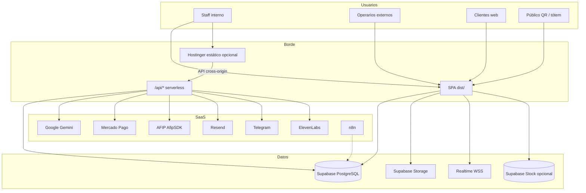
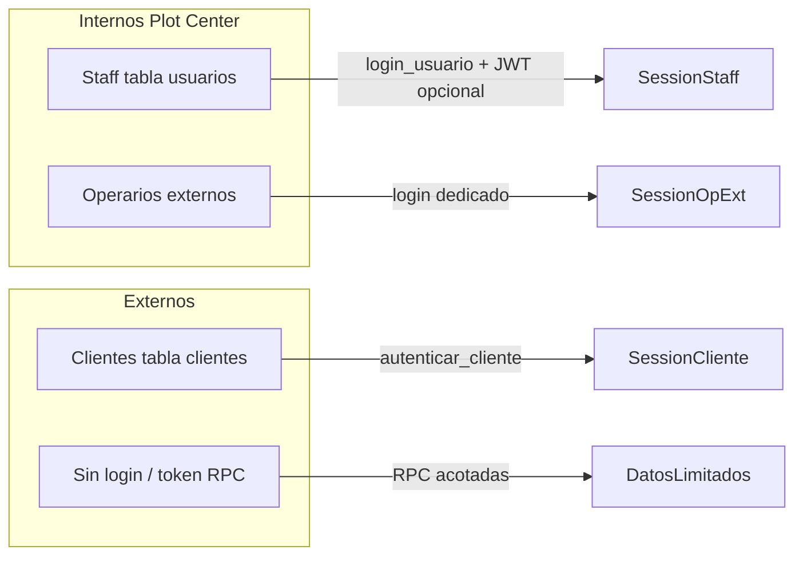

# Informe integral de infraestructura — Plotrello / PlotLab

Documento de referencia técnica y organizacional del sistema (junio 2026). Cubre arquitectura, carpetas del repo, secciones de la app, usuarios/roles, datos, APIs, despliegue y brechas conocidas.

---

## Índice

1. [Resumen ejecutivo](#1-resumen-ejecutivo)  
2. [Arquitectura global](#2-arquitectura-global)  
3. [Carpetas del repositorio](#3-carpetas-del-repositorio)  
4. [Frontend](#4-frontend)  
5. [Catálogo completo de rutas](#5-catálogo-completo-de-rutas)  
6. [API serverless (Vercel)](#6-api-serverless-vercel)  
7. [Base de datos Supabase](#7-base-de-datos-supabase)  
8. [Usuarios, roles y permisos](#8-usuarios-roles-y-permisos)  
9. [Sectores y organización operativa](#9-sectores-y-organización-operativa)  
10. [Secciones funcionales (módulos)](#10-secciones-funcionales-módulos)  
11. [Integraciones externas](#11-integraciones-externas)  
12. [Seguridad](#12-seguridad)  
13. [Variables de entorno](#13-variables-de-entorno)  
14. [Despliegue y dominios](#14-despliegue-y-dominios)  
15. [Flujos de datos clave](#15-flujos-de-datos-clave)  
16. [Proyectos colaterales y scripts](#16-proyectos-colaterales-y-scripts)  
17. [Brechas, deuda técnica y roadmap](#17-brechas-deuda-técnica-y-roadmap)

---

## 1. Resumen ejecutivo

**Plotrello** (marca operativa **PlotLab**) es el sistema interno de **Plot Center**: producción gráfica e imprenta, ventas, ERP, caja, RRHH, portal cliente, tótem y asistentes IA.

| Dimensión | Valor |
|-----------|--------|
| **Tipo** | SPA React + BaaS (Supabase) + serverless (Vercel) |
| **Stack** | React 19, Vite 7, TypeScript 5.9, React Router 7 |
| **Node** | 20.x |
| **Páginas** | ~160 (`src/pages/`) |
| **Endpoints API** | ~48 archivos TS en `api/` |
| **Parches SQL** | ~449 en `supabase/patches/` |
| **Tablas usadas en código** | ~90+ identificadas en `api.ts` + caja |
| **RPC PostgreSQL** | ~263 funciones referenciadas en `api.ts` |
| **Capa de datos cliente** | `src/services/api.ts` (~23.000 líneas) |
| **Hosting** | Vercel (`plotrello.vercel.app`) + dominio `trello.plotcenter.com.ar` |
| **Servidores propios** | Ninguno con puertos abiertos (Jamstack) |

No hay backend PHP activo en el camino principal del código React; la documentación legacy de Hostinger/MySQL quedó como referencia histórica.

---

## 2. Arquitectura global



**Split Hostinger ↔ Vercel:** si el usuario entra por `trello.plotcenter.com.ar`, el HTML/JS puede servirse desde Hostinger, pero las llamadas a `/api/*` se resuelven contra **`https://plotrello.vercel.app`** (`src/utils/plotLabApiOrigin.ts`).

---

## 3. Carpetas del repositorio

### 3.1 Raíz

| Carpeta / archivo | Rol |
|-------------------|-----|
| **`src/`** | Aplicación React principal |
| **`api/`** | Funciones serverless Vercel |
| **`lib/`** | Código compartido API (auth JWT, MP, AFIP, seguridad) |
| **`supabase/patches/`** | Migraciones SQL manuales (RPC, RLS, triggers) |
| **`public/`** | Assets estáticos, manuales, imágenes |
| **`scripts/`** | PDFs, migraciones postulantes, import precios, cache |
| **`docs/`** | Seguridad, procesos |
| **`dist/`** | Build Vite (generado) |
| **`n8n-workflows/`** | Automatizaciones externas |
| **`Cliente/`** | Starter Shopify headless (no deploy principal) |
| **`Postulantes/`** | Batches importación CV/legajos |
| **`phi-site/`**, **`Reloj/`**, **`dashboard-m-o-n-k-y/`** | Proyectos satélite |

### 3.2 `src/` — estructura interna

| Carpeta | Contenido |
|---------|-----------|
| **`pages/`** | ~160 pantallas (1 ruta ≈ 1 página) |
| **`components/`** | UI compartida: tablero, modales, PlotAI, login, cliente |
| **`features/`** | Módulos encapsulados (caja, conciliación MP, work-pool, phi) |
| **`routes/`** | `StaffAppHost.tsx` (~140 rutas staff), `ClientePortalRoutes.tsx` |
| **`services/`** | `api.ts`, `supabaseClient.ts`, `staffAuthApi.ts`, PlotAI |
| **`hooks/`** | `useAuth`, PWA, caja operativa, display nombres |
| **`utils/`** | Permisos sector, sesión, fechas Argentina, mappers OP |
| **`types/`** | `api.ts` (tipos dominio), `board.ts`, `workPool.ts` |
| **`data/`** | Columnas kanban mock, fallbacks |
| **`contexts/`** | PWA update |
| **`admin/`** | App separada (`admin.html`) |
| **`tablet-firma/`**, **`tablet-reloj/`** | SPAs tablet |

### 3.3 `src/features/` — módulos de dominio

| Módulo | Archivos | Responsabilidad |
|--------|----------|-----------------|
| **`control-cajas/`** | ~70+ | Caja operativa/admin, Plot Lab→caja, arqueo, conciliación |
| **`conciliacion-mp/`** | ~10 | Motor conciliación Mercado Pago + Gemini |
| **`work-pool/`** | ~15 | Bolsa Plot, Plot Design, operarios externos |
| **`phi/`** | ~8 | Landing PHI pública |

El resto del negocio vive en **`pages/`** + **`services/api.ts`**.

### 3.4 Supabase Storage — “carpetas” lógicas

| Bucket | Rutas típicas | Uso |
|--------|---------------|-----|
| **`archivos`** | `ordenes/{id}/`, `erp-gastos/`, `rrhh-bajas/` | Adjuntos OP, gastos, bajas |
| **`legajos`** | fotos empleados | RRHH |
| **`pedidos-clientes`** | archivos pedido portal | Portal cliente |
| **`briefs-publicos`** | briefs cliente | Formularios públicos |

---

## 4. Frontend

### 4.1 Puntos de entrada (multi-SPA)

| HTML | Ruta base | Uso |
|------|-----------|-----|
| `index.html` | `/` | PlotLab staff + público |
| `admin.html` | `/admin` | Panel admin legacy (dashboard tablero) |
| `tablet-firma.html` | `/tablet-firma` | Firma entrega en tablet |
| `tablet-reloj.html` | `/tablet-reloj` | Reloj / marcación con cámara |

`vercel.json` reescribe todas las rutas no-API al HTML correspondiente.

### 4.2 Build y chunks

- **Build:** `tsc && vite build` → `dist/`
- **Chunks manuales:** `vendor-supabase`, `vendor-pdf`, `vendor-xlsx`, `vendor-google-ai`, `api`, `supabase-client`
- **PWA:** Workbox, `NetworkFirst` en navegación, sin precache de HTML (evita chunks rotos post-deploy)

### 4.3 Providers globales (`main.tsx`)

```
ErrorBoundary → AuthProvider → UsuariosDisplayProvider → App
initPlotlabVentaCajaBridge()  // eventos Plot Lab → caja
```

### 4.4 Capas de navegación

| Capa | Dónde | Función |
|------|-------|---------|
| **Router raíz** | `App.tsx` | Público, tótem, login, portal cliente, `/*` → staff |
| **Staff host** | `StaffAppHost.tsx` | ~140 rutas internas lazy-loaded |
| **Menú módulos** | `/menu` (`MenuOnlyPage`) | Selector de área |
| **Header rápido** | `headerQuickNav.ts` | Accesos por rol |
| **Sidebars** | Ej. caja `NAV_CAJA` / `NAV_ADMIN` | Subsecciones del módulo |

---

## 5. Catálogo completo de rutas

### 5.1 Rutas públicas y autenticación (`App.tsx`)

| Ruta | Audiencia |
|------|-----------|
| `/login` | Staff PlotLab |
| `/embed/chat`, `/embed/chat-widget` | Chat embebido web |
| `/totem`, `/totem/autogestion/*` | Kiosco autogestión |
| `/totem/consulta-cliente`, `/totem/finalizado-taller` | Flujo tótem taller |
| `/totem/subir-archivo/:sessionId` | QR upload |
| `/totem/pantalla` | Pantalla informativa |
| `/asesor` | Tablet asesor |
| `/consulta-cliente` | Consulta OP cliente |
| `/dashboard-pantallas` | Pantallas internas |
| `/op-public/:opNumber` | Seguimiento OP (QR) |
| `/firma-cliente/:opNumber` | Firma entrega |
| `/brief/:token` | Brief público |
| `/reclamos` | Reclamos públicos |
| `/trabaja-con-nosotros`, `/postulacion-operarios` | CV / postulación |
| `/phi` | Landing PHI |
| `/satisfaccion-cliente` | Encuesta satisfacción |
| `/op-eliminadas` | OP eliminadas (restricción en app) |
| `/operario-bolsa/solicitud` | Solicitud bolsa |
| `/operario-externo/login` | Login operarios externos |
| `/operario-externo`, `/diseno`, `/bolsa` | Paneles externos |
| `/cliente/login`, `/cliente/*` | Portal cliente |
| `/*` | Staff autenticado → `StaffAppHost` |

### 5.2 Portal cliente (`/cliente/*`)

| Ruta | Sección |
|------|---------|
| `/cliente/dashboard` | Inicio |
| `/cliente/catalogo` | Catálogo artículos |
| `/cliente/carrito`, `/checkout` | Compra |
| `/cliente/pedido/:id` | Detalle pedido |
| `/cliente/presupuestos`, `/presupuesto/nuevo`, `/presupuesto/:id` | Presupuestos |
| `/cliente/buscar-op/:numeroOp?` | Buscar OP |
| `/cliente/mensajes/:idPedido?` | Mensajes pedido |
| `/cliente/disenos`, `/brief/:token` | Briefs / diseños |
| `/cliente/reclamos` | Reclamos |
| `/cliente/chat` | Chat |
| `/cliente/notificaciones` | Notificaciones |
| `/cliente/ayuda` | Ayuda |

### 5.3 Staff — producción y comunicación

| Ruta | Sección |
|------|---------|
| `/`, `/tablero` | Kanban principal OP |
| `/menu` | Selector de módulos |
| `/admin` | Panel admin/gerencia |
| `/kanban-etapas/:slug` | Kanban por etapa sector |
| `/statistics` | Estadísticas tablero |
| `/calendario`, `/gantt` | Planificación |
| `/op/:opNumber` | Vista OP |
| `/chat` | Chat interno estilo Slack |
| `/mensajeria`, `/mensajeria/verificar/:token` | Mensajería con prueba lectura |
| `/consulta-cliente` | Consulta staff |
| `/herramienta` | Herramientas varias |
| `/usuarios` | Gestión usuarios (admin) |

### 5.4 Staff — mostrador, clientes, ventas

| Ruta | Sección |
|------|---------|
| `/mostrador/dashboard` | Dashboard mostrador |
| `/mostrador/ordenes-listas` | Órdenes listas entrega |
| `/mostrador/buscar-cliente` | Búsqueda cliente |
| `/mostrador/entrega/:id` | Entrega |
| `/mostrador/calendario` | Calendario mostrador |
| `/mostrador/reportes`, `/ventas`, `/ventas/reportes` | Reportes |
| `/mostrador/clientes-frecuentes` | Clientes frecuentes |
| `/mostrador/cuenta-corriente/*` | Cuenta corriente |
| `/clientes/*` | CRM clientes (dashboard, perfil, alta, CC) |
| `/ventas`, `/ventas/reportes` | CRM ventas |
| `/atencion-publico` | Reclamos / atención |

### 5.5 Staff — caja

| Ruta | Vista |
|------|-------|
| `/caja/dashboard` | Redirige según rol |
| `/caja/dashboard/caja` | Operativa (cajero) |
| `/caja/dashboard/admin` | Administración cajas |

### 5.6 Staff — compras y stock

| Ruta | Sección |
|------|---------|
| `/compras/dashboard` | Panel compras |
| `/compras/pedidos`, `/pedidos/:id` | Pedidos compra |
| `/compras/crear-pedido`, `/mis-pedidos` | Alta / mis pedidos |
| `/compras/gestion-stock`, `/reportes-stock` | Stock |
| `/compras/proveedores` | Proveedores |
| `/compras/deudas-proveedores`, `/pagos-proveedores`, etc. | Finanzas proveedores |
| `/compras/conciliacion-bancaria`, `/conciliacion-mercadopago` | Conciliación |

### 5.7 Staff — diseño, presupuestos, bolsa

| Ruta | Sección |
|------|---------|
| `/diseno/dashboard` | Dashboard diseño |
| `/galeria`, `/galeria-trabajos` | Galería trabajos |
| `/briefs-pendientes` | Briefs pendientes |
| `/asesor-presupuestos` | Kanban asesor técnico / presupuestos |
| `/plot-design` | Admin Plot Design |
| `/bolsa-plot`, `/bolsa` | Admin Bolsa Plot |
| `/app-campo` | App campo instalaciones |

### 5.8 Staff — taller, impresión, inventario

| Ruta | Sección |
|------|---------|
| `/impresoras`, `/impresoras/totem` | Impresoras + cola tótem |
| `/taller-grafico/dashboard`, `/inventario` | Taller gráfico |
| `/metalurgica/inventario` | Metalúrgica |

### 5.9 Staff — RRHH (completo)

| Ruta | Sección |
|------|---------|
| `/rrhh/dashboard` | Panel RRHH |
| `/rrhh/usuarios` | Usuarios + legajos |
| `/rrhh/horarios` | Horarios / turnos |
| `/rrhh/permisos` | Permisos laborales |
| `/rrhh/evaluaciones` | Evaluaciones |
| `/rrhh/capacitaciones` | Capacitaciones |
| `/rrhh/menu-diario` | Menú del día (admin) |
| `/menu-diario` | Menú del día (todos) |
| `/rrhh/notificaciones` | Notificaciones por rol/sector |
| `/rrhh/pruebas`, `/mis-pruebas` | Pruebas / competencias |
| `/rrhh/incidencias`, `/novedades` | Incidencias y novedades |
| `/rrhh/postulaciones` | Postulantes |
| `/rrhh/desvinculaciones` | Bajas |
| `/rrhh/reportes`, `/estadisticas` | Reportes por usuario/sector/período |
| `/capacitaciones` | Vista empleado capacitaciones |

### 5.10 Staff — portal web admin, actas, flota

| Ruta | Sección |
|------|---------|
| `/clientes-web/*` | Pedidos portal, artículos, presupuestos web |
| `/libro-actas`, `/libro-actas/sector/:sectorId` | Libro de actas por sector |
| `/protocolos-bases` | Protocolos y bases conocimiento |
| `/flota`, `/flota/admin` | Vehículos y administración flota |

### 5.11 Staff — ERP (completo)

| Ruta | Módulo ERP |
|------|------------|
| `/erp` | Dashboard |
| `/erp/facturas`, `/nueva`, `/:id`, `/:id/nota` | Facturación AFIP |
| `/erp/asientos` | Asientos contables |
| `/erp/tesoreria`, `/tesoreria/cuentas` | Tesorería |
| `/erp/contabilidad`, `/contabilidad/reportes` | Contabilidad |
| `/erp/impuestos` | Impuestos |
| `/erp/cuentas-por-cobrar`, `/cuentas-por-pagar` | CxC / CxP |
| `/erp/compras`, `/stock`, `/crm` | Puentes módulos |
| `/erp/gastos` | Gastos + comprobantes |
| `/erp/plan-cuentas`, `/costos`, `/reportes` | Plan y costos |
| `/erp/admin`, `/admin/condiciones-venta` | Config ERP |
| `/erp/configuracion-afip` | Config AFIP |

---

## 6. API serverless (Vercel)

Runtime: **Node 20**, paquete `@vercel/node`. Seguridad: `lib/api/security.ts`.

### 6.1 Autenticación

| Endpoint | Función |
|----------|---------|
| `POST /api/auth/staff-login` | Emite JWT staff 12h |
| `GET /api/auth/staff-session` | Verifica sesión |
| `GET /api/auth/staff-jwt-status` | Estado JWT en servidor |

### 6.2 PlotAI / IA

| Endpoint | Función |
|----------|---------|
| `/api/plotai/generate-content` | Texto Gemini (staff) |
| `/api/plotai/generate-image` | Imágenes |
| `/api/plotai/generate-video` | Video |
| `/api/plotai/chat-public` | FAQ público |
| `/api/plotai/brief-completo` | Brief asistido |
| `/api/plotai/pedido-especificacion` | Especificación pedido |
| `/api/plotai/sprint-*` | Sprint predict/report/snapshot |
| `/api/plotai/totem-live-context` | Contexto Gemini Live tótem |
| `/api/plotai/live-voice` | Voz en vivo |
| `/api/plotai/elevenlabs-tts` | Text-to-speech |
| `/api/plotai/conversation-respuestas` | Respuestas conversación |
| `/api/plotai/satisfaccion-entrega-informe` | Informe satisfacción |
| `/api/plotai/health` | Health check |

### 6.3 Reloj tablet (RRHH)

| Endpoint | `maxDuration` |
|----------|---------------|
| `reloj-tablet-identificar` | 60s |
| `reloj-tablet-precalentar` | 60s |
| `reloj-tablet-marcar-auto` | 60s |
| `reloj-tablet-verificar` | 30s |
| `reloj-tablet-marcar`, `reloj-tablet-empleados`, `asistencia-reloj` | — |

### 6.4 Mercado Pago

| Endpoint | Contexto |
|----------|----------|
| `/api/mp/checkout`, `/checkout-status`, `/webhook` | Pagos generales |
| `/api/totem/mp-checkout`, `/mp-preference`, `/mp-status`, `/mp-webhook` | Tótem impresión |

### 6.5 ERP / AFIP

| Endpoint | Función |
|----------|---------|
| `/api/erp/afip-autorizar` | Autorizar comprobante |
| `/api/erp/afip-test` | Prueba homologación |
| `/api/erp/extract-ticket` | OCR ticket gasto |

### 6.6 RRHH

| Endpoint | Función |
|----------|---------|
| `/api/rrhh/submit-cv` | CV público |
| `/api/rrhh/extract-cv` | Extracción IA CV |
| `/api/rrhh/extract-certificado` | Certificados |
| `/api/rrhh/filter-postulaciones` | Filtro postulaciones |

### 6.7 Admin, notificaciones, bots

| Endpoint | Protección |
|----------|------------|
| `/api/admin/backup-json` | Bearer `PLOT_LAB_BACKUP_TOKEN` |
| `/api/admin/fichas-activas-pdf` | Idem |
| `/api/notify-orden-lista` | `NOTIFY_ORDEN_WEBHOOK_SECRET` |
| `/api/telegram/webhook` | Secret Telegram |
| `/api/cron/agenda-telegram-reminders` | `CRON_SECRET` |

---

## 7. Base de datos Supabase

### 7.1 Modelo de acceso

- Cliente browser: **anon key** + RLS
- Serverless: **service role** (donde aplica)
- Lógica de negocio: **~263 RPC** + queries directas en `api.ts`
- Schema configurable: `VITE_SUPABASE_SCHEMA` (históricamente `public` o legacy `u956355532_tg`)
- **Segundo proyecto opcional:** stock (`VITE_STOCK_SUPABASE_*`)

### 7.2 Tablas principales por dominio

**Producción / OP**

`ordenes_trabajo`, `historial_movimientos`, `tarea_subitems`, `tareas`, `orden_lineas_m2`, `orden_materiales`, `orden_relevamiento`, `relevamiento_subitems`, `enlaces_adjuntos`, `comentarios_orden`, `costos_op`, `firmas_entrega_cliente`, `impresoras`, `impresora_uso`, `impresora_historial_estado`, `totem_impresion_solicitudes`

**Usuarios / RRHH**

`usuarios`, `usuarios_publico`, `usuarios_bajas_log`, `legajos_empleados`, `legajos`, `rrhh_eventos_laborales`, `rrhh_novedades`, `rrhh_reloj_reportes_semanales`, `horarios_empleados`, `asistencia`, `sectores`, `usuario_sectores`, `menu_descuentos_beneficio_comida`

**Clientes / ventas / CC**

`clientes`, `clientes_cuenta_corriente`, `cc_cuenta_movimientos`, `ventas`, `ventas_items`, `presupuestos_ventas`, `presupuestos`, `presupuestos_items`, `oportunidades` (vía RPC)

**Portal web**

`pedidos_clientes`, `pedidos_clientes_archivos`, `presupuestos_clientes`, `articulos_empresa`, `articulos_empresa_imagenes`, `briefs_publicos_archivos`

**Compras / proveedores**

`pedidos_compras`, `pedidos_compras_items`, `pedidos_compras_comentarios`, `proveedores`, `proveedores_productos`, `deudas_proveedores`, `pagos_proveedores`, `movimientos_proveedores`, `deuda_cc_proveedores`, `materiales`, `articulos`

**Stock**

`stock_depositos`, `stock_movimientos`, `stock_saldo_deposito`

**ERP / contabilidad**

`facturas_venta`, `facturas_items`, `facturas_compra`, `facturas_compra_items`, `asientos_contables`, `asientos_detalle`, `plan_cuentas`, `cuentas_bancarias`, `movimientos_bancarios`, `cuentas_por_cobrar`, `cuentas_por_pagar`, `pagos`, `pagos_cobros`, `erp_alertas_cxp`, `conciliaciones_bancarias`, `conciliacion_mp_sessions`, `conciliacion_mp_ai_runs`

**Caja** (`control_caja_*`)

`control_caja_cajas`, `control_caja_movimientos`, `control_caja_arqueos`, `control_caja_cierres`, `control_caja_planillas`, `control_caja_traspasos`, `control_caja_egreso_solicitudes`, `control_caja_transferencia_lotes`, `control_caja_concil_mp`, `control_caja_concil_banco`, `control_caja_diferencias`

**Atención / chat**

`atencion_reclamos`, `atencion_conversaciones`, `atencion_satisfaccion_encuestas`, `atencion_satisfaccion_entrega`, `chat_rooms`, `chat_messages`, `solicitudes_atencion_chat`, `user_notifications`

**Flota**

`vehiculos`, `reservas_vehiculos_flota`, `registros_salidas_vehiculos`

**Otros**

`protocolos_bases`, `vista_auditoria_completa`, vistas impresoras (`v_impresoras_ocupacion`, etc.)

### 7.3 RPC — categorías (muestra)

| Categoría | Ejemplos RPC |
|-----------|--------------|
| Auth | `login_usuario`, `logout_usuario`, `crear_usuario`, `dar_de_baja_usuario` |
| OP | `create_orden_with_contact`, `update_orden_with_contact`, `sync_op_grupo_sectores_y_fichas` |
| Público | `get_orden_seguimiento_publico`, `crear_brief_publico`, `registrar_satisfaccion_entrega_public` |
| Cliente | `autenticar_cliente`, `crear_pedido_cliente`, `convertir_pedido_a_op` |
| CC | `cc_obtener_perfil_cliente`, `cc_registrar_pago`, `calcular_scoring_cuenta_corriente` |
| RRHH | `crear_actualizar_legajo`, `crear_solicitud_permiso`, `listar_fechas_plot_hoy` |
| Actas | `crear_acta_sector`, `listar_actas_sector` |
| Chat | `chat_marcar_leido`, `obtener_o_crear_room_dm` |
| Ventas | `crear_venta_directa`, `crear_venta_desde_pedido_cliente` |
| ERP | `crear_asiento_desde_factura`, `crear_asiento_desde_pago_cobro` |
| Tótem | `crear_solicitud_impresion_totem`, `crear_sesion_qr_upload_totem` |

### 7.4 Caja — doble persistencia

| Modo | Cuándo | Dónde |
|------|--------|-------|
| **Remoto** | Tablas `control_caja_*` en Supabase | `usesRemoteStorage() === true` |
| **Local** | Sin patches / sin conexión | `localStorage` key `plotlab_control_cajas_v1` |

---

## 8. Usuarios, roles y permisos

### 8.1 Tipos de identidad



### 8.2 Staff — tabla `usuarios`

| Campo | Descripción |
|-------|-------------|
| `id` | PK entera (no Supabase Auth UUID) |
| `nombre` | Login (email habitual) |
| `rol` | `UserRole` |
| `password_hash` | bcrypt vía RPC |

**Gestión:** `/usuarios` (admin), `/rrhh/usuarios` (legajos, bajas).

**Display:** `nombreVisible` desde legajo (`legajos_empleados`), no el email de login.

### 8.3 Roles staff (`UserRole`) — catálogo completo

| Código | Etiqueta | Home / módulo principal |
|--------|----------|-------------------------|
| `administracion` | Administración | `/admin` + todo |
| `gerencia` | Gerencia | `/admin` |
| `mostrador` | Mostrador | `/mostrador/dashboard` + caja |
| `caja` | Caja | `/caja/dashboard/caja` |
| `presupuestos` | Presupuestos | `/asesor-presupuestos` |
| `asesor-tecnico` | Asesor Técnico | `/asesor-presupuestos` |
| `diseno` | Diseño | `/diseno/dashboard` + Plot Design |
| `imprenta` | Imprenta | `/impresoras` |
| `taller-grafico` | Taller Gráfico | `/taller-grafico/dashboard` |
| `instalaciones` | Instalaciones | `/app-campo` + Bolsa Plot |
| `metalurgica` | Metalúrgica | `/metalurgica/inventario` + Bolsa |
| `compras` | Compras | `/compras/dashboard` |
| `recursos-humanos` | RRHH | `/rrhh/dashboard` |
| `operario-diseno` | Operario diseño ext. | `/operario-externo/diseno` |
| `operario-bolsa` | Operario bolsa ext. | `/operario-externo/bolsa` |

### 8.4 Matriz de permisos UI (`useAuth`)

| Flag | Quién |
|------|-------|
| `isAdmin` | `administracion`, `gerencia` |
| `canManageCaja` | `mostrador`, `caja`, admin |
| `canAccessMostradorViews` | caja operativa, presupuestos, admin |
| `canManageCompras` | `compras`, admin |
| `canViewPedidoCompraDetalle` | compras, admin, gerencia |
| `canManageRecursosHumanos` | RRHH, admin, gerencia |
| `canManagePresupuestos` | presupuestos, asesor técnico, admin |
| `canManageAsesorTecnico` | asesor técnico, admin |
| `canManageWorkPool` | admin, presupuestos |
| `canAccessPlotDesign` | admin, presupuestos, diseño, operario diseño |
| `canAccessBolsaPlot` | admin, presupuestos, instalaciones, metalúrgica, operario bolsa |
| `canAccessTotemImpresionPanel` | admin, imprenta, mostrador, caja, taller gráfico |
| `canMarcarPagoTotemImpresion` | caja operativa, admin |
| `canAccessAtencionPublico` | cualquier staff logueado |
| `isWorkPoolOperario` | diseño, instalaciones, metalúrgica, operarios externos |

**Alcance de datos (ejemplos):**

- Ventas/caja operativa: mostrador y caja ven **solo propio** (`idVendedorParaConsulta`, `filtroUsuarioCajaOperativa`).
- Admin y presupuestos: ven equipo completo.
- ERP en menú: pensado para **admin**; RLS aún en evolución.

### 8.5 Sesión staff — almacenamiento

| Key `localStorage` | Contenido |
|--------------------|-----------|
| `usuario` | JSON `{ id, nombre, rol, nombreVisible? }` |
| `usuario_id` | ID numérico |
| `auth_token` | JWT staff (si servidor lo emite) |
| `plotlab_session_kind` | `staff` \| `operario_externo` |
| `plotlab_login_usuario` | Login usado |

**Flujo login:** `staffLogin` → RPC `login_usuario` → opcional `/api/auth/staff-login` (JWT) → `persistStaffSession`.

### 8.6 Legajo (`legajos_empleados`)

Vinculado por `id_usuario`. Campos: nombre, apellido, sector, funciones, DNI, contacto emergencia, foto, fechas ingreso/nacimiento. Alimenta reportes RRHH, menú diario, competencias, novedades por sector.

### 8.7 Clientes web (`clientes`)

Login portal `/cliente/login` vía RPC `autenticar_cliente`. Campos: empresa, CUIT, contacto, `drive_link` (carpeta/archivos cliente), cuenta corriente, pedidos portal.

### 8.8 Operarios externos

- Roles: `operario-diseno`, `operario-bolsa`
- Login: `/operario-externo/login` (separado de staff)
- Solo ven trabajos **asignados** desde Plot Design / Bolsa Plot admin
- OP enmascarada (sin número OP interno en panel)

### 8.9 Notificaciones RRHH — audiencias

En `/rrhh/notificaciones`, destino:

- **Todos** | **Por rol** | **Por sector** | **Usuarios específicos**

Sectores disponibles en UI: Diseño Gráfico, Taller de Imprenta, Taller Gráfico, Mostrador, Caja, Instalaciones, Metalúrgica, Asesor Técnico, Presupuestos, Recursos Humanos, etc.

### 8.10 Header rápido — accesos comunes (todos los staff)

- Menú diario (`/menu-diario`)
- Flota (`/flota`)
- Permisos (solicitar o gestionar según rol)
- Solicitar productos
- Vía Pública (externo, admin/presupuestos)

---

## 9. Sectores y organización operativa

### 9.1 Tres conceptos de “sector”

| Concepto | Dónde | Uso |
|----------|-------|-----|
| **Columnas kanban** | `BOARD_COLUMNS` | Flujo OP en tablero |
| **Sectores organizativos** | `sectores` + `ROL_TO_SECTORES` | Libro de actas, permisos |
| **`usuario_sectores`** | Tabla N:N | Campo instalaciones/metalúrgica por persona |

### 9.2 Columnas kanban (flujo producción)

| ID | Etiqueta |
|----|----------|
| `diseno-grafico` | Diseño Gráfico |
| `diseno-proceso` | Diseño en Proceso |
| `en-espera` | En Espera |
| `imprenta` | Imprenta |
| `taller-imprenta` | Taller de Imprenta |
| `taller-grafico` | Taller Gráfico |
| `instalaciones` | Instalaciones |
| `metalurgica` | Metalúrgica |
| `finalizado-taller` | Finalizado en Taller |
| `almacen-entrega` | Almacén de Entrega |

### 9.3 Mapeo rol → sector (libro de actas)

| Rol | Sector(es) |
|-----|------------|
| `diseno` | Diseño Gráfico |
| `imprenta` | Taller de Imprenta |
| `taller-grafico` | Taller Gráfico |
| `mostrador` | Mostrador |
| `caja` | Caja |
| `instalaciones` | Instalaciones |
| `metalurgica` | Metalúrgica |
| `asesor-tecnico` | Asesor Técnico |
| `presupuestos` | Presupuestos |
| `recursos-humanos` | Recursos Humanos |
| `administracion` / `gerencia` | **Todos** |

---

## 10. Secciones funcionales (módulos)

### 10.1 Menú módulos (`/menu`) — tarjetas

| Tarjeta | Ruta | Habilitado si |
|---------|------|---------------|
| Tótem impresión | `/impresoras/totem` | Panel tótem |
| Mostrador | `/mostrador/dashboard` | Vista mostrador |
| Caja | `/caja/dashboard` | Caja operativa o admin |
| Compras | `/compras/dashboard` | Compras o admin |
| ERP | `/erp` | Admin |
| Presupuestos | `/asesor-presupuestos` | Presupuestos/asesor/admin |
| RRHH | `/rrhh/dashboard` | RRHH/admin/gerencia |
| Tablero | `/` | Siempre (staff) |
| Atención público | `/atencion-publico` | Siempre |

### 10.2 Caja — secciones sidebar

**Operativa:** Menú → Mi arqueo → Cierre turno → Pase → Traspasos → Egresos → Mis movimientos → Asistente IA (+ PDF colapsado).

**Admin:** Calendario → Cierre → Egresos → Arqueos → Movimientos → Cierres → MP → Banco → Centro IA.

### 10.3 Admin home (`/admin`)

KPIs tablero, pedidos portal pendientes, backup JSON, PDF fichas activas, acceso PlotAI, enlaces a módulos.

### 10.4 `admin.html` (app separada)

Dashboard administrativo con tablero embebido, reportes, OP eliminadas — comparte hooks/auth con app principal.

---

## 11. Integraciones externas

| Servicio | Uso | Clave |
|----------|-----|-------|
| **Supabase** | DB, RPC, Storage, Realtime | `VITE_*` + `SUPABASE_SERVICE_ROLE_KEY` |
| **Google Gemini** | PlotAI, OCR, conciliación, caja inteligente | `GEMINI_API_KEY` (servidor) |
| **ElevenLabs** | TTS voz tótem/PlotAI | Server API |
| **Mercado Pago** | Tótem, portal, webhooks | `MERCADOPAGO_ACCESS_TOKEN` |
| **AFIP (AfipSDK)** | Factura electrónica | `AFIP_*` |
| **Resend** | Email transaccional | `RESEND_API_KEY` |
| **Telegram** | Recordatorios agenda, bots | `TELEGRAM_*` |
| **n8n** | Automatizaciones | Externo |
| **Vía Pública** | Sitio externo VP | `vp-zeta-eight.vercel.app` |

---

## 12. Seguridad

### 12.1 Zonas de acceso

| Zona | Auth | Ejemplos |
|------|------|----------|
| Pública acotada | RPC/token | `/op-public`, firma, brief |
| Portal cliente | `autenticar_cliente` | `/cliente/*` |
| Staff | `login_usuario` + JWT | Resto PlotLab |
| Operario externo | Login dedicado | `/operario-externo/*` |

### 12.2 Headers HTTP (`vercel.json`)

HSTS, `X-Frame-Options: DENY` (excepto `/embed/*`), CSP frame-ancestors en embeds, `Permissions-Policy` (mic/cámara bloqueados salvo `/totem` y `/tablet-reloj`), cache `no-store` en HTML, `immutable` en `/assets/*`.

### 12.3 Riesgos principales

| Riesgo | Mitigación |
|--------|------------|
| Anon key en bundle | RLS estricto (~263 RPC + policies) |
| `api.ts` monolítico | Difícil auditar permisos por pantalla |
| Storage posiblemente público | Migrar a signed URLs (P1) |
| 449 parches sueltos | Drift entre entornos |
| Caja localStorage | Datos solo en navegador sin Supabase |
| Gemini en cliente (legacy) | Quitar `VITE_GEMINI_API_KEY` prod |

---

## 13. Variables de entorno

Ver `.env.example` completo. Resumen:

**Cliente (VITE_):** `VITE_SUPABASE_URL`, `VITE_SUPABASE_ANON_KEY`, `VITE_SUPABASE_SCHEMA`, `VITE_STOCK_SUPABASE_*`, `VITE_PLOTLAB_API_ORIGIN`, `VITE_API_BASE_URL` (legacy PHP).

**Servidor (Vercel):** `SUPABASE_SERVICE_ROLE_KEY`, `GEMINI_API_KEY`, `MERCADOPAGO_ACCESS_TOKEN`, `AFIP_*`, `RESEND_API_KEY`, `TELEGRAM_*`, `PLOT_LAB_STAFF_JWT_SECRET`, `PLOT_LAB_BACKUP_TOKEN`, `NOTIFY_ORDEN_WEBHOOK_SECRET`, `CRON_SECRET`, `PLOT_LAB_ALLOWED_ORIGINS`.

**Dev only:** `VITE_DEV_MOCK_AUTH=1`, `VITE_DEV_LAN=1`.

---

## 14. Despliegue y dominios

| Entorno | URL |
|---------|-----|
| Producción Vercel | `https://plotrello.vercel.app` |
| Dominio custom | `https://trello.plotcenter.com.ar` |
| Repo | `github.com/webplotcentersj-hash/plotrello` |
| CI GitHub Actions | No configurado |
| Deploy | Push `main` → build Vercel automático |

**Comandos npm relevantes:**

```bash
npm run dev          # Vite :5173
npm run build        # tsc + vite build
npm run test:caja    # tests caja Node
npm run manual:pdf   # generación manuales
```

---

## 15. Flujos de datos clave

### 15.1 OP: creación → tablero → sectores

```
Mostrador/Presupuestos → create_orden_with_contact (RPC)
  → ordenes_trabajo + historial_movimientos
  → Kanban (columna = sector/estado)
  → sync_op_grupo_sectores_y_fichas (multi-sector)
  → Entrega → firma_cliente / firmas_entrega_cliente
```

### 15.2 Venta Plot Lab → Caja

```
CRMVentasPage cobro → ventas + dispararSyncCajaVenta
  → control_caja_movimientos (origen plotlab_venta)
  → Menú caja lee API ventas + movimientos en vivo
  → Arqueo compara billetes vs efectivo Plot Lab
```

### 15.3 Pedido portal → OP

```
Cliente /cliente/checkout → pedidos_clientes
  → Admin /clientes-web/pedidos → convertir_pedido_a_op (RPC)
  → ordenes_trabajo en tablero
```

### 15.4 Factura ERP

```
/erp/facturas/nueva → facturas_venta
  → /api/erp/afip-autorizar → AFIP
  → crear_asiento_desde_factura (RPC) → asientos_contables
```

---

## 16. Proyectos colaterales y scripts

| Recurso | Propósito |
|---------|-----------|
| `scripts/migrar-postulantes-legacy.mjs` | Import postulantes |
| `scripts/import-lista-precios-flexxus.mjs` | Lista precios |
| `scripts/build-manual-pdf.mjs` | Manuales PDF |
| `Postulantes/_batches/` | SQL batches import |
| `n8n-workflows/` | Integraciones |
| `Cliente/headless-shopify-starter/` | E-commerce Shopify (aparte) |
| `MANUAL_PROCESOS_ESTADOS.pdf` | Documentación procesos |

---

## 17. Brechas, deuda técnica y roadmap

| Prioridad | Tema | Acción recomendada |
|-----------|------|-------------------|
| Alta | RLS incompleto ERP/RRHH | Policies por rol incremental |
| Alta | `api.ts` monolítico | Partir por dominio |
| Alta | Migraciones formales | `supabase/migrations` versionadas |
| Media | Split hosting | Unificar en Vercel o documentar CORS |
| Media | Gemini 100% servidor | Eliminar `VITE_GEMINI_API_KEY` |
| Media | Storage privado + signed URLs | P1 seguridad |
| Media | CI mínimo | `tsc` + tests en PR |
| Baja | ERP roles “borrador” | Enforcement rutas + RLS |
| Baja | JWT cliente portal | Completar auth cliente |
| Baja | PITR Supabase | Backup además de JSON manual |

---

## Referencias en el repo

| Documento / archivo | Contenido |
|---------------------|-----------|
| `README.md` | Instalación |
| `docs/SEGURIDAD.md` | Mapa seguridad, checklist deploy |
| `.env.example` | Variables completas |
| `vercel.json` | Rewrites, headers, crons |
| `src/utils/plotLabApiOrigin.ts` | Split API Vercel/Hostinger |
| `src/hooks/useAuth.tsx` | Permisos UI |
| `src/utils/sectorPermissions.ts` | Rol ↔ sector actas |
| `src/routes/StaffAppHost.tsx` | Rutas staff |
| `src/services/api.ts` | Capa datos |
| `supabase/patches/` | Esquema y RPC |
