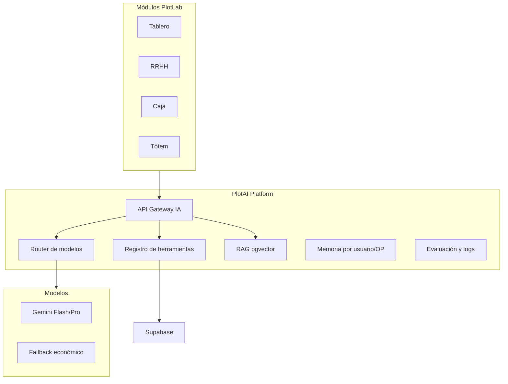

# Informe de inversión — PlotLab / Plotrello

**Objetivo:** que la plataforma sea más rápida, escalable de verdad, y pueda crecer en módulos, agentes de IA y herramientas sin que cada feature nueva vuelva a “tildar” todo.

**Fecha de referencia:** julio 2026  
**Base del análisis:** arquitectura actual del repositorio (React 19 + Vite, ~160 pantallas, `api.ts` monolítico ~23.000 líneas / ~850 KB, Supabase + Vercel, PlotAI vía Gemini disperso en decenas de puntos).

Documentos relacionados: [INFORME_INFRAESTRUCTURA.md](./INFORME_INFRAESTRUCTURA.md), [INFRAESTRUCTURA_APP_Y_BD.md](./INFRAESTRUCTURA_APP_Y_BD.md).

---

## Índice

1. [Diagnóstico: por qué hoy no escala bien](#1-diagnóstico-por-qué-hoy-no-escala-bien)
2. [Pilares de inversión](#2-pilares-de-inversión)
3. [Roadmap por fases](#3-roadmap-de-inversión-por-fases)
4. [Matriz de prioridades](#4-matriz-dónde-poner-cada-peso)
5. [Presupuesto resumido](#5-presupuesto-resumido-escenarios)
6. [Recomendación ejecutiva](#6-recomendación-ejecutiva)

---

## 1. Diagnóstico: por qué hoy no escala bien

PlotLab no es “lenta por una sola cosa”. Es la suma de **cuatro cuellos de botella** que compiten:

| Capa | Situación actual | Efecto |
|------|------------------|--------|
| **Frontend** | SPA gigante; tablero con cientos de OPs; fichas pesadas; mucho estado global | Congelamiento del navegador |
| **Cliente de datos** | Un solo `api.ts` con ~263 RPC y lógica de negocio mezclada | Bundle enorme, difícil de mantener y optimizar |
| **Supabase** | Plan probablemente limitado (Nano/Micro); realtime amplio; consultas masivas | Timeouts, lentitud intermitente (incidentes de capacidad regional) |
| **IA (PlotAI)** | Gemini llamado desde muchos módulos sin capa unificada | Costos impredecibles, sin gobernanza ni reutilización de herramientas |

### Métricas de referencia (repo)

| Dimensión | Valor |
|-----------|--------|
| Páginas React | ~160 (`src/pages/`) |
| `api.ts` (cliente) | ~23.000 líneas / ~850 KB |
| RPC PostgreSQL referenciadas | ~263 |
| Parches SQL (`supabase/patches/`) | ~449 |
| Endpoints serverless (`api/`) | ~48 archivos |
| Rutas lazy en `StaffAppHost` | ~100 imports diferidos |

**Conclusión:** invertir solo en “más features” o “más IA” sin arreglar la base **multiplica la deuda** y el costo operativo.

---

## 2. Pilares de inversión

### Pilar A — Infraestructura y plataforma (impacto inmediato en velocidad)

**Qué invertir**

| Ítem | Para qué | Prioridad |
|------|----------|-----------|
| **Supabase Compute** (subir de Nano → Small/Medium) | Más CPU/RAM para consultas del tablero, RRHH, ERP, realtime | **Crítica** |
| **Supabase Pro/Team** + spend cap bien configurado | Backups, soporte, límites predecibles | Alta |
| **Connection Pooler (Supavisor)** bien configurado | Evitar agotar conexiones con muchos usuarios simultáneos | Alta |
| **Vercel Pro** (o plan acorde al tráfico) | Builds más rápidos, analytics, límites de funciones | Media |
| **Entorno staging** (segundo proyecto Supabase + preview Vercel) | Probar sin romper producción | Alta |
| **CDN / caché** (reforzar headers y edge cache en lecturas) | Menos round-trips repetidos | Media |

**Orden de magnitud mensual (USD, orientativo)**

| Nivel | Componentes | Rango mensual |
|-------|-------------|---------------|
| Mínimo serio | Supabase Pro + compute Small + Vercel Pro | USD 150–250 |
| Escalable | Compute Medium, más storage, observabilidad | USD 400–800 |
| Producción intensa | Team, réplicas, colas, Redis | USD 800–1.500+ |

> Los incidentes de capacidad en regiones como `sa-east-1` confirman que **depender de un único proyecto en región saturada sin plan de respaldo** es riesgo operativo, no solo de performance.

---

### Pilar B — Arquitectura de software (escalabilidad estructural)

**Problema central:** `src/services/api.ts` concentra casi todo el acceso a datos. Eso impide escalar equipo, features y performance a la vez.

**Arquitectura objetivo**

```mermaid
flowchart LR
  subgraph client [Frontend]
    Pages[Páginas por dominio]
    Domains[ordenes / rrhh / erp / caja services]
  end
  subgraph edge [BFF Vercel]
    API["/api/ordenes", "/api/rrhh", ...]
  end
  subgraph data [Supabase]
    PG[(PostgreSQL)]
    RPC[RPC livianas]
    RT[Realtime acotado]
  end
  Pages --> Domains
  Domains --> API
  Domains --> RPC
  API --> PG
  RT --> Pages
```

| Iniciativa | Beneficio | Esfuerzo estimado |
|------------|-----------|-------------------|
| **Partir `api.ts` por dominio** (`ordenesService`, `rrhhService`, `erpService`, …) | Bundles chicos, equipos paralelos | 2–4 meses |
| **BFF en Vercel** para operaciones pesadas (tablero, reportes, imports) | Menos lógica en el browser; caché server-side | 1–2 meses |
| **Migraciones formales** (Supabase CLI, no solo `patches/` sueltos) | Deploys seguros, rollback | 1 mes setup + hábito continuo |
| **Vistas materializadas / RPC “lite”** (modelo RRHH postulaciones) | Listados rápidos sin JSON enorme | Continuo por módulo |
| **Realtime acotado** (solo columnas/estados necesarios) | Menos carga cliente + WSS | 2–4 semanas |
| **Virtualización del tablero** (react-window / TanStack Virtual) | 500+ OPs sin congelar UI | 2–3 semanas |
| **Cola de trabajos** (Trigger.dev, Inngest o worker en Railway) | Imports, PDFs, IA larga, AFIP, sin bloquear UI | 1–2 meses |

**Inversión humana estimada:** 1 dev senior plataforma medio tiempo durante 6 meses, o 1 full-time 3 meses → **USD 15.000–40.000** según mercado (freelance vs interno).

---

### Pilar C — Datos y performance (lo que más se siente en el día a día)

| Acción | Ejemplo PlotLab | Impacto |
|--------|-----------------|---------|
| **Auditoría de índices** | `ordenes_trabajo(estado, entregado, id)`, RRHH, notificaciones | Alto |
| **Límites y paginación estrictos** | Tablero: 150–200 OP activas + “cargar más” server-side | Alto |
| **Separar lectura/escritura** | Listados vía RPC/vistas; detalle bajo demanda | Alto |
| **Archivar OPs entregadas** (>90 días) a tabla histórica | Tablero siempre liviano | Medio-alto |
| **Redis / Upstash** (opcional) | Caché de sesión, badges, catálogos | Medio |
| **Segundo proyecto Supabase** solo para analytics/reportes | No compite con operación | Medio (fase 2) |

**Patrón ya probado en el repo:** `rrhh_postulaciones_listar_lite` — metadata recortada, límite en servidor, sin `metadata_ia::text` en búsquedas. Replicar en otros listados masivos.

---

### Pilar D — PlotAI y agentes (de “prompts sueltos” a plataforma)

Hoy PlotAI está en: tablero, RRHH/CV, caja, CRM, tótem, conciliación MP, sprint optimizer, etc. **Sin capa común de agentes, tools, memoria ni costos.**

**Arquitectura objetivo: PlotAI Platform**



| Componente | Función | Costo mensual orientativo |
|------------|---------|---------------------------|
| **API Gateway IA** (`/api/plotai/*` unificado) | Auth, rate limit, logging, retries | Incluido en Vercel |
| **Registro de tools** | `buscar_op`, `mover_ficha`, `listar_postulaciones`, `leer_comprobante`… | Desarrollo |
| **RAG con pgvector** (en Supabase) | Manuales, protocolos, lista de precios, legajos | +USD 0–50 storage |
| **Gemini API** | Uso real según volumen | USD 50–500/mes (arranque → escala) |
| **Observabilidad IA** (Langfuse, Helicone o logs propios) | Costo por módulo, calidad, A/B | USD 0–100/mes |
| **n8n** (ya documentado en `docs/n8n-integration.md`) | Automatizaciones sin código | Self-host ~USD 20/mes o cloud |

#### Agentes sugeridos por fase

| Fase | Agente | Herramientas | ROI operativo |
|------|--------|--------------|---------------|
| 1 | **Asesor de tablero** | buscar OP, sugerir prioridad, resumir ficha | Menos tiempo en mostrador |
| 1 | **RRHH screening** | score CV, comparar puesto, draft entrevista | Ya iniciado; formalizar |
| 2 | **Caja / conciliación** | leer comprobantes, match MP, alertas | Menos errores manuales |
| 2 | **Compras / stock** | sugerir pedido, detectar quiebre | Menos quiebres |
| 3 | **Orquestador multi-agente** | coordina diseño → producción → entrega | Diferenciador fuerte |

**Inversión humana IA:** 1 dev con experiencia en LLM + 1 persona de dominio (operaciones) para definir tools → **3–4 meses** para plataforma v1.

---

### Pilar E — Observabilidad y calidad

| Herramienta | Para qué | Costo orientativo |
|-------------|----------|-------------------|
| **Sentry** (frontend + API) | Errores, performance traces | ~USD 26/mes |
| **Vercel Analytics / Speed Insights** | Web Vitals, rutas lentas | Incluido en Pro |
| **Supabase Dashboard + alertas** | CPU, conexiones, slow queries | Incluido |
| **Playwright E2E** (tablero, login, crear OP) | Regresiones antes de deploy | Tiempo de desarrollo |
| **Load test** (k6 en tablero + getOrdenes) | Saber límite real antes de crecer | 1 sprint |

**Sin observabilidad, cada inversión en features es a ciegas.**

---

### Pilar F — Equipo y proceso

PlotLab ya es un **ERP operativo completo** (~160 pantallas: ERP, RRHH, caja, flota, tótem, portal cliente). Eso no lo sostiene bien un solo dev a largo plazo.

| Rol | Dedicación | Por qué |
|-----|------------|---------|
| **Tech lead / plataforma** | 50–100% | Arquitectura, Supabase, performance |
| **Frontend** | 50–100% | Tablero, UX, virtualización |
| **Backend / datos** | 50% | RPC, migraciones, colas |
| **IA / automatización** | 25–50% | PlotAI platform, agentes, n8n |
| **QA / soporte interno** | 25% | Pruebas en taller real antes de producción |

**Mínimo viable para crecer sin romper:** tech lead + 1 dev → **USD 4.000–8.000/mes** (Argentina/LATAM remoto).

---

## 3. Roadmap de inversión por fases

### Fase 0 — Estabilizar (0–3 meses)

**Inversión estimada:** USD 5.000–15.000 (desarrollo) + USD 150–250/mes (infra)

**Objetivo:** que deje de “tildarse” en uso normal.

- [ ] Subir Supabase Compute (Small mínimo)
- [ ] Entorno staging + proceso de deploy controlado
- [ ] Sentry + métricas básicas
- [ ] Tablero: fichas livianas, virtualización, realtime acotado
- [ ] RPC lite en todos los listados masivos (modelo RRHH postulaciones)
- [ ] Empezar split de `api.ts` (órdenes + RRHH primero)
- [ ] Reintentos y pausa de sync con pestaña oculta (ya iniciado)

**KPI:** tiempo de carga tablero < 3 s; 0 freezes > 2 s en operación normal.

---

### Fase 1 — Escalar operación (3–6 meses)

**Inversión estimada:** USD 15.000–30.000 + USD 400–600/mes (infra)

**Objetivo:** 30–50 usuarios concurrentes sin degradación.

- [ ] BFF para tablero y reportes pesados
- [ ] Cola de trabajos (imports masivos, PDFs, IA de larga duración)
- [ ] Archivo de OPs históricas (>90 días entregadas)
- [ ] PlotAI Gateway v1 + 5 tools core
- [ ] pgvector para manuales y protocolos (RAG)
- [ ] Tests E2E en flujos críticos (login, tablero, crear OP)

**KPI:** p95 API tablero < 800 ms; costo IA predecible por módulo.

---

### Fase 2 — Plataforma de producto (6–12 meses)

**Inversión estimada:** USD 30.000–60.000 + USD 600–1.000/mes (infra)

**Objetivo:** sumar módulos y agentes sin reescribir todo.

- [ ] Dominios desacoplados en frontend (micro-frontends opcional)
- [ ] Catálogo de agentes PlotAI (RRHH, caja, ventas, tótem)
- [ ] Integraciones: WhatsApp Business API, más ERP externo, BI
- [ ] Read replica o proyecto analytics separado
- [ ] Builds dedicados mobile/tablet (reloj, firma, campo)

**KPI:** nuevo módulo en < 4 semanas sin tocar tablero core.

---

### Fase 3 — Escala comercial (12+ meses)

- Multi-sucursal / multi-tenant (si PlotLab se comercializa a otros talleres)
- SLA 99.9%, soporte extendido, compliance (backups geo, auditoría)
- Marketplace de integraciones

---

## 4. Matriz: dónde poner cada peso

| Si el objetivo es… | Invertir primero en… | Evitar… |
|--------------------|----------------------|---------|
| **Más velocidad ya** | Supabase compute + índices + tablero virtualizado | Más pantallas nuevas sin optimizar |
| **Más funciones** | Split `api.ts` + staging + tests | Otro monolito en el cliente |
| **Más IA** | PlotAI Gateway + tools + RAG | Gemini directo en cada página |
| **Más usuarios** | Pooler + colas + BFF + caché | Realtime en tablas enteras sin filtro |
| **Menos riesgo** | Observabilidad + staging + migraciones CLI | Deploy directo a producción |

---

## 5. Presupuesto resumido (escenarios)

| Escenario | Infra / mes | Desarrollo (6 meses) | Resultado esperado |
|-----------|-------------|----------------------|--------------------|
| **Mínimo** | USD 150–250 | USD 15.000 (1 dev part-time) | Estable; pocos módulos nuevos |
| **Recomendado** | USD 400–600 | USD 40.000 (tech lead + dev + IA) | Rápido, escalable, agentes v1 |
| **Ambicioso** | USD 800–1.500 | USD 80.000+ (equipo 3–4) | PlotLab como producto vendible |

---

## 6. Recomendación ejecutiva

1. **Infra primero:** Supabase con compute real + entorno staging. Sin eso, ningún refactor frontend alcanza.
2. **Arquitectura segundo:** romper el monolito `api.ts` y unificar PlotAI en una plataforma con tools. Eso habilita features y agentes sin volver a congelar la app.
3. **IA tercero pero con disciplina:** agentes con herramientas acotadas y RAG sobre datos propios (manuales, OPs, precios), no más prompts sueltos en cada pantalla.

---

## Anexo — Mejoras ya aplicadas (julio 2026)

Referencia de trabajo reciente en performance (commits en `main`):

| Área | Cambio |
|------|--------|
| RRHH postulaciones | RPC lite, auto-carga, parser JSONB |
| Tablero | API diferida (`apiLoader`), fichas livianas por defecto, realtime batch |
| Resiliencia | Reintentos Supabase, sync pausado con pestaña oculta |
| Vercel | Rewrites que no interceptan `/assets/` |

Estas mejoras mitigan síntomas; **no sustituyen** la inversión en infra y arquitectura descrita arriba.

---

*Documento generado para Plot Center / PlotLab. Actualizar cuando cambien plan Supabase, tamaño del equipo o prioridades de producto.*
