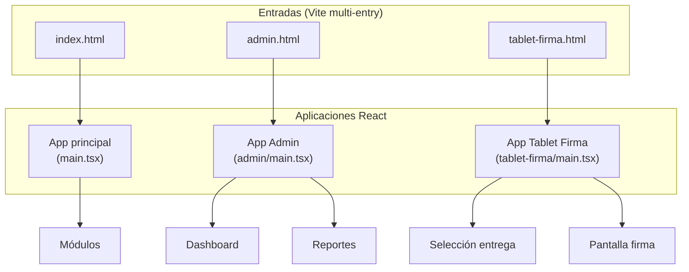
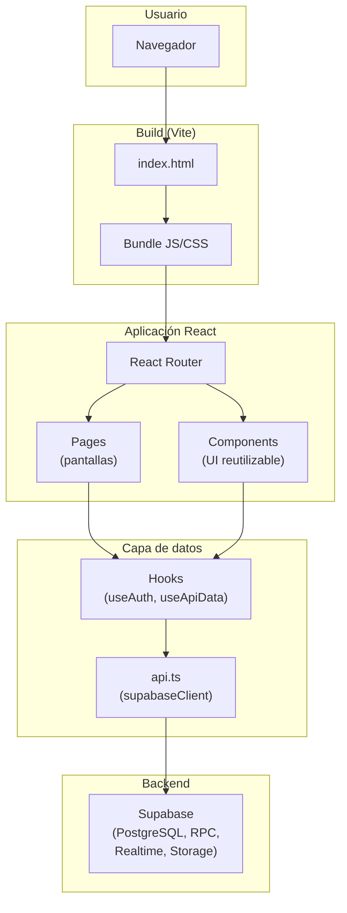
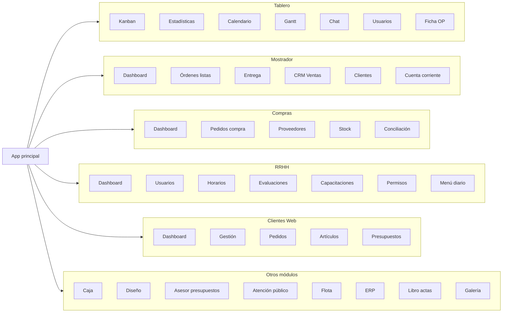
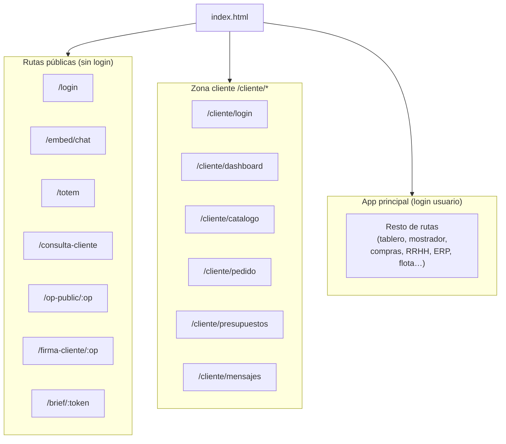
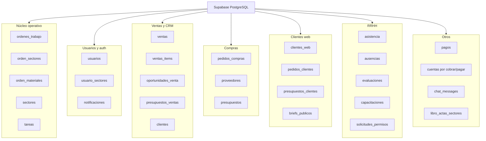
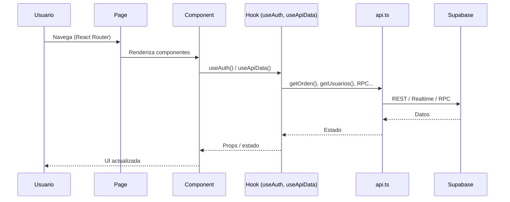

# Infraestructura completa: Web y Base de datos

**Plot Lab / Plotrello** — Referencia técnica (aplicación + BD + tablas + funciones + roles).

---

## Infraestructura gráfica

Los siguientes diagramas resumen la arquitectura. Se pueden visualizar en cualquier visor de Markdown que soporte Mermaid (GitHub, GitLab, VS Code con extensión, etc.).

### Diagrama 1 — Entradas y aplicaciones



### Diagrama 2 — Capas de la aplicación principal



### Diagrama 3 — Módulos y áreas de la app principal



### Diagrama 4 — Zona cliente web y rutas públicas



### Diagrama 5 — Base de datos: grupos principales de tablas



### Diagrama 6 — Flujo de datos (usuario → BD)



---

## Parte 1 — Infraestructura de la aplicación web

### 1.1 Stack técnico

| Capa | Tecnología |
|------|------------|
| Frontend | React 19, TypeScript, Vite 7 |
| Routing | React Router v7 |
| Backend / Datos | Supabase (PostgreSQL, Realtime, Storage, RPC) |
| UI / Gráficos | CSS modular por página/componente, Recharts, @hello-pangea/dnd |
| Otros | date-fns, jspdf, html2canvas, qrcode, xlsx, marked, Google Generative AI (PlotAI) |

### 1.2 Entradas de la aplicación

Cada entrada es un HTML que carga un bundle distinto (multi-entry en `vite.config.ts`).

| Archivo HTML      | Script de entrada     | Descripción |
|-------------------|------------------------|-------------|
| **index.html**    | `src/main.tsx`         | App principal: tablero Kanban, mostrador, compras, RRHH, CRM ventas, clientes web, caja, diseño, asesor presupuestos, atención público, flota, ERP, libro actas, galería, briefs pendientes, estadísticas, calendario, Gantt, chat, usuarios, impresoras, herramienta, consulta cliente, embeds de chat, totem, firma cliente, OP pública, brief público y zona cliente web. |
| **admin.html**    | `src/admin/main.tsx`   | App admin: dashboard y reportes (protegido por rol). |
| **tablet-firma.html** | `src/tablet-firma/main.tsx` | App tablet: selección de entrega y pantalla de firma del cliente. |

**URLs de acceso:**
- App principal: la raíz del dominio (p. ej. `/`, `/mostrador/dashboard`, `/op/123`, `/clientes-web/dashboard`).
- Admin: servir `admin.html` (p. ej. `/admin.html` o ruta configurada en el servidor).
- Tablet firma: servir `tablet-firma.html` (p. ej. `/tablet-firma.html`).

### 1.3 Todas las rutas y páginas

#### Rutas públicas (sin login interno)

| Path | Componente |
|------|------------|
| `/login` | `Login` (formulario usuario/contraseña) |
| `/embed/chat` | `EmbedChatPage` |
| `/embed/chat-widget` | `EmbedChatWidgetPage` |
| `/totem` | `TotemChatPage` |
| `/consulta-cliente` | `ClienteConsultaPage` |
| `/dashboard-pantallas` | `DashboardPantallasPage` |
| `/op-public/:opNumber` | `OpPublicPage` |
| `/firma-cliente/:opNumber` | `FirmaClientePage` |
| `/brief/:token` | `BriefPublicoPage` |

#### Rutas zona cliente web (`/cliente/*`)

Requieren login de cliente. Redirección a `/cliente/login` si no hay sesión.

| Path | Componente |
|------|------------|
| `/cliente/login` | `ClienteLoginPage` |
| `/cliente/dashboard` | `ClienteDashboardPage` |
| `/cliente/catalogo` | `ClienteCatalogoPage` |
| `/cliente/nuevo-pedido` | `ClienteNuevoPedidoPage` |
| `/cliente/pedido/:id` | `ClientePedidoDetallePage` |
| `/cliente/presupuestos` | `ClientePresupuestosPage` |
| `/cliente/presupuesto/nuevo` | `ClientePresupuestoFormPage` |
| `/cliente/presupuesto/:id` | `ClientePresupuestoDetallePage` |
| `/cliente/presupuesto/:id/editar` | `ClientePresupuestoFormPage` |
| `/cliente/buscar-op/:numeroOp?` | `ClienteBuscarOpPage` |
| `/cliente/mensajes/:idPedido?` | `ClienteMensajesPage` |

#### Rutas app principal (requieren login usuario)

| Path | Componente |
|------|------------|
| `/` | `BoardPage` |
| `/statistics` | `StatisticsPage` |
| `/calendario` | `CalendarPage` |
| `/gantt` | `GanttPage` |
| `/op/:opNumber` | `OpViewPage` |
| `/chat` | `ChatPage` |
| `/consulta-cliente` | `ClienteConsultaPage` |
| `/usuarios` | `UsuariosPage` |
| `/impresoras` | `ImpresorasPage` |
| `/herramienta` | `HerramientaPage` |
| `/mostrador/dashboard`, `/mostrador` | `MostradorDashboardPage` |
| `/mostrador/ordenes-listas` | `OrdenesListasPage` |
| `/mostrador/buscar-cliente` | `BuscarClientePage` |
| `/mostrador/entrega/:id` | `EntregaPage` |
| `/mostrador/calendario` | `CalendarioEntregasPage` |
| `/mostrador/reportes` | `ReportesMostradorPage` |
| `/mostrador/ventas` | `CRMVentasPage` |
| `/mostrador/ventas/reportes` | `ReportesVentasPage` |
| `/mostrador/clientes-frecuentes` | `ClientesFrecuentesPage` |
| `/mostrador/cuenta-corriente` | `CuentaCorrientePage` |
| `/atencion-publico` | `AtencionPublicoDashboardPage` |
| `/crm-ventas` | `CRMVentasPage` |
| `/crm-ventas/reportes` | `ReportesVentasPage` |
| `/caja/dashboard` | `CajaDashboardPage` |
| `/compras/dashboard`, `/compras`, `/compras/pedidos` | `ComprasDashboardPage` |
| `/compras/pedidos/:id` | `PedidoCompraDetallePage` |
| `/compras/reportes` | `ReportesStockPage` (y `ReportesComprasPage` en otra ruta) |
| `/compras/gestion-stock` | `GestionStockPage` |
| `/compras/proveedores` | `ProveedoresPage` |
| `/compras/presupuestos/:id` | `PresupuestosPage` |
| `/compras/calendario-entregas` | `CalendarioEntregasPage` |
| `/compras/crear-pedido` | `CrearPedidoCompraPage` |
| `/mis-pedidos` | `MisPedidosPage` |
| `/compras/conciliacion-bancaria` | `ConciliacionBancariaPage` |
| `/diseno/dashboard`, `/diseno` | `DisenoDashboardPage` |
| `/asesor-presupuestos` | `AsesorPresupuestosPage` |
| `/galeria`, `/galeria-trabajos` | `GaleriaTrabajosPage` |
| `/briefs-pendientes` | `BriefsPendientesPage` |
| `/rrhh/dashboard`, `/rrhh` | `RecursosHumanosDashboardPage` |
| `/rrhh/usuarios` | `RecursosHumanosUsuariosPage` |
| `/rrhh/reportes` | `RecursosHumanosReportesPage` |
| `/rrhh/horarios` | `RecursosHumanosHorariosPage` |
| `/rrhh/evaluaciones` | `RecursosHumanosEvaluacionesPage` |
| `/rrhh/capacitaciones` | `RecursosHumanosCapacitacionesPage` |
| `/rrhh/estadisticas` | `RecursosHumanosEstadisticasPage` |
| `/rrhh/menu-diario` | `RecursosHumanosMenuDiarioPage` |
| `/rrhh/permisos` | `RecursosHumanosPermisosPage` |
| `/rrhh/notificaciones` | `RecursosHumanosNotificacionesPage` |
| `/capacitaciones` | `CapacitacionesPage` |
| `/menu-diario` | `MenuDiarioPage` |
| `/clientes-web/dashboard`, `/clientes-web` | `ClientesWebDashboardPage` |
| `/clientes-web/gestion` | `ClientesWebGestionPage` |
| `/clientes-web/pedidos` | `PedidosClientesPage` |
| `/clientes-web/pedidos/:id/detalle` | `PedidoClienteDetalleAdminPage` |
| `/clientes-web/pedidos/:id/convertir` | `ConvertirPedidoAOpPage` |
| `/clientes-web/articulos` | `ArticulosEmpresaPage` |
| `/clientes-web/categorias` | `CategoriasArticulosPage` |
| `/clientes-web/presupuestos` | `PresupuestosClientesAdminPage` |
| `/clientes-web/presupuestos/:id` | `PresupuestoClienteDetalleAdminPage` |
| `/libro-actas` | `LibroActasPage` |
| `/libro-actas/sector/:sectorId` | `LibroActasSectorPage` |
| `/flota` | `FlotaPage` |
| `/flota/admin` | `FlotaAdminDashboard` |
| `/erp` | `ERPDashboardPage` |
| `/erp/facturas` | `FacturasPage` |
| `/erp/facturas/nueva` | `CrearFacturaPage` |
| `/erp/facturas/:id` | `FacturaDetallePage` |
| `/erp/asientos` | `AsientosContablesPage` |
| `/erp/configuracion-afip` | `ConfiguracionAFIPPage` |

#### Rutas app Admin (`admin.html`)

| Path | Componente |
|------|------------|
| `/` | `AdminDashboard` |
| `/reportes` | `AdminReports` |

#### Rutas app Tablet Firma (`tablet-firma.html`)

| Path | Componente |
|------|------------|
| `/` | `TabletFirmaSelectPage` |
| `/:id` | `TabletFirmaPage` |

### 1.4 Listado de todas las páginas con su función

Cada página se nombra una por una con la ruta (o rutas) que atiende y su función.

#### App principal (`src/pages/`)

| Página | Ruta(s) | Función |
|--------|---------|--------|
| ArticulosEmpresaPage | `/clientes-web/articulos` | CRUD de artículos de la empresa para catálogo y pedidos. |
| AsesorPresupuestosPage | `/asesor-presupuestos` | Vista tipo Kanban para asesor técnico: briefs y presupuestos. |
| AsientosContablesPage | `/erp/asientos` | Listado y gestión de asientos contables. |
| AtencionPublicoDashboardPage | `/atencion-publico` | Dashboard de atención al público y reclamos. |
| BoardPage | `/` | Tablero Kanban principal de órdenes de trabajo. |
| BriefPublicoPage | `/brief/:token` | Formulario público de brief por token (sin login). |
| BriefsPendientesPage | `/briefs-pendientes` | Listado de briefs pendientes de procesar. |
| BuscarClientePage | `/mostrador/buscar-cliente` | Búsqueda de clientes desde mostrador. |
| CajaDashboardPage | `/caja/dashboard` | Dashboard de caja (ingresos, pagos, flujo). |
| CalendarioEntregasPage | `/mostrador/calendario`, `/compras/calendario-entregas` | Calendario de entregas (mostrador y compras). |
| CalendarPage | `/calendario` | Vista calendario de tareas del tablero. |
| CapacitacionesPage | `/capacitaciones` | Listado e inscripción a capacitaciones (vista empleado). |
| CategoriasArticulosPage | `/clientes-web/categorias` | CRUD de categorías de artículos. |
| ChatPage | `/chat` | Chat interno entre usuarios. |
| ClienteBuscarOpPage | `/cliente/buscar-op/:numeroOp?` | Cliente web: buscar OP por número. |
| ClienteCatalogoPage | `/cliente/catalogo` | Cliente web: catálogo de artículos. |
| ClienteConsultaPage | `/consulta-cliente` | Consulta pública de estado (OP/pedido) sin login. |
| ClienteDashboardPage | `/cliente/dashboard` | Dashboard del cliente web (resumen, accesos). |
| ClienteLoginPage | `/cliente/login` | Login de clientes web (email/contraseña). |
| ClienteMensajesPage | `/cliente/mensajes/:idPedido?` | Cliente web: mensajes de pedidos. |
| ClienteNuevoPedidoPage | `/cliente/nuevo-pedido` | Cliente web: crear nuevo pedido. |
| ClientePedidoDetallePage | `/cliente/pedido/:id` | Cliente web: detalle de un pedido. |
| ClientePresupuestoDetallePage | `/cliente/presupuesto/:id` | Cliente web: ver presupuesto. |
| ClientePresupuestoFormPage | `/cliente/presupuesto/nuevo`, `/cliente/presupuesto/:id/editar` | Cliente web: crear o editar presupuesto. |
| ClientePresupuestosPage | `/cliente/presupuestos` | Cliente web: listado de presupuestos. |
| ClientesFrecuentesPage | `/mostrador/clientes-frecuentes` | Listado de clientes frecuentes (mostrador). |
| ClientesWebDashboardPage | `/clientes-web/dashboard`, `/clientes-web` | Dashboard de gestión de clientes web. |
| ClientesWebGestionPage | `/clientes-web/gestion` | Gestión de cuentas clientes web (empresas/usuarios). |
| ComprasDashboardPage | `/compras/dashboard`, `/compras`, `/compras/pedidos` | Dashboard de compras y listado de pedidos. |
| ConciliacionBancariaPage | `/compras/conciliacion-bancaria` | Conciliación bancaria. |
| ConfiguracionAFIPPage | `/erp/configuracion-afip` | Configuración AFIP para facturación. |
| ConvertirPedidoAOpPage | `/clientes-web/pedidos/:id/convertir` | Convertir pedido de cliente en orden de trabajo. |
| CrearFacturaPage | `/erp/facturas/nueva` | Alta de nueva factura. |
| CrearPedidoCompraPage | `/compras/crear-pedido` | Crear pedido de compra a proveedor. |
| CRMVentasPage | `/mostrador/ventas`, `/crm-ventas` | CRM de ventas: oportunidades y ventas. |
| CuentaCorrientePage | `/mostrador/cuenta-corriente` | Cuenta corriente de clientes (mostrador). |
| DashboardPantallasPage | `/dashboard-pantallas` | Dashboard para pantallas/totems. |
| DisenoDashboardPage | `/diseno/dashboard`, `/diseno` | Dashboard del sector diseño. |
| EmbedChatPage | `/embed/chat` | Chat embebido (iframe) para atención. |
| EmbedChatWidgetPage | `/embed/chat-widget` | Widget de chat embebido. |
| EntregaPage | `/mostrador/entrega/:id` | Proceso de entrega y firma en mostrador. |
| ERPDashboardPage | `/erp` | Dashboard ERP (resumen contable/facturación). |
| FacturaDetallePage | `/erp/facturas/:id` | Detalle de una factura. |
| FacturasPage | `/erp/facturas` | Listado de facturas. |
| FirmaClientePage | `/firma-cliente/:opNumber` | Pantalla de firma del cliente (entrega). |
| FlotaAdminDashboard | `/flota/admin` | Administración de flota de vehículos. |
| FlotaPage | `/flota` | Vista de flota (estado, ubicación). |
| GaleriaTrabajosPage | `/galeria`, `/galeria-trabajos` | Galería de trabajos realizados. |
| GestionStockPage | `/compras/gestion-stock` | Gestión de stock e inventario. |
| GanttPage | `/gantt` | Vista Gantt de tareas. |
| HerramientaPage | `/herramienta` | Herramienta interna (utilidades/config). |
| ImpresorasPage | `/impresoras` | Estado y ocupación de impresoras. |
| LibroActasPage | `/libro-actas` | Libro de actas por sector (índice). |
| LibroActasSectorPage | `/libro-actas/sector/:sectorId` | Libro de actas de un sector. |
| MenuDiarioPage | `/menu-diario` | Menú del día (selección de platos). |
| MisPedidosPage | `/mis-pedidos` | Pedidos de compra del usuario actual. |
| MostradorDashboardPage | `/mostrador/dashboard`, `/mostrador` | Dashboard de mostrador (órdenes, ventas rápidas). |
| OpPublicPage | `/op-public/:opNumber` | Vista pública de una OP (sin login). |
| OpViewPage | `/op/:opNumber` | Detalle de orden de trabajo (ficha completa). |
| OrdenesListasPage | `/mostrador/ordenes-listas` | Órdenes listas para retiro/entrega. |
| PedidoClienteDetalleAdminPage | `/clientes-web/pedidos/:id/detalle` | Detalle de pedido de cliente (admin). |
| PedidoCompraDetallePage | `/compras/pedidos/:id` | Detalle de pedido de compra. |
| PedidosClientesPage | `/clientes-web/pedidos` | Listado de pedidos de clientes web. |
| PresupuestoClienteDetalleAdminPage | `/clientes-web/presupuestos/:id` | Detalle de presupuesto de cliente (admin). |
| PresupuestosClientesAdminPage | `/clientes-web/presupuestos` | Listado y gestión de presupuestos de clientes. |
| PresupuestosPage | `/compras/presupuestos/:id` | Ver presupuesto de compra. |
| ProveedoresPage | `/compras/proveedores` | CRUD de proveedores. |
| RecursosHumanosCapacitacionesPage | `/rrhh/capacitaciones` | Gestión de capacitaciones (RRHH). |
| RecursosHumanosDashboardPage | `/rrhh/dashboard`, `/rrhh` | Dashboard de RRHH. |
| RecursosHumanosEvaluacionesPage | `/rrhh/evaluaciones` | Evaluaciones de desempeño. |
| RecursosHumanosEstadisticasPage | `/rrhh/estadisticas` | Estadísticas de RRHH. |
| RecursosHumanosHorariosPage | `/rrhh/horarios` | Horarios y turnos. |
| RecursosHumanosMenuDiarioPage | `/rrhh/menu-diario` | Gestión del menú diario. |
| RecursosHumanosNotificacionesPage | `/rrhh/notificaciones` | Notificaciones internas. |
| RecursosHumanosPermisosPage | `/rrhh/permisos` | Solicitudes de permisos y ausencias. |
| RecursosHumanosReportesPage | `/rrhh/reportes` | Reportes de RRHH. |
| RecursosHumanosUsuariosPage | `/rrhh/usuarios` | Gestión de usuarios y legajos (RRHH). |
| ReportesComprasPage | `/compras/reportes` | Reportes de compras. |
| ReportesMostradorPage | `/mostrador/reportes` | Reportes de mostrador. |
| ReportesStockPage | `/compras/reportes` | Reportes de stock. |
| ReportesVentasPage | `/mostrador/ventas/reportes`, `/crm-ventas/reportes` | Reportes de ventas/CRM. |
| StatisticsPage | `/statistics` | Estadísticas del tablero. |
| TotemChatPage | `/totem` | Chat para totem de atención. |
| UsuariosPage | `/usuarios` | Gestión de usuarios y roles (admin). |

#### App admin (`src/admin/pages/`)

| Página | Ruta(s) | Función |
|--------|---------|--------|
| AdminDashboard | `/` | Dashboard admin: resumen global y métricas. |
| AdminReports | `/reportes` | Reportes administrativos. |

#### App tablet firma (`src/tablet-firma/pages/`)

| Página | Ruta(s) | Función |
|--------|---------|--------|
| TabletFirmaSelectPage | `/` | Seleccionar entrega a firmar (listado). |
| TabletFirmaPage | `/:id` | Pantalla de firma para la entrega elegida. |

### 1.5 Estructura de `src/` y función de cada componente

#### Raíz y estilos

| Archivo | Función |
|---------|--------|
| main.tsx | Punto de entrada React de la app principal. |
| App.tsx | Router y definición de todas las rutas de la app principal. |
| app.css / style.css | Estilos globales. |

#### components/ — Componentes reutilizables (cada uno con su función)

| Componente | Función |
|------------|--------|
| ActivityFeed | Muestra el feed de actividad del tablero. |
| AdminAlertButton | Botón de alertas para admin. |
| AgendaAsesorTecnico | Agenda y citas del asesor técnico. |
| Board | Contenedor del tablero Kanban (columnas y tareas). |
| BriefLinkSection | Sección de enlace a brief en ficha. |
| BuscadorClientesModal | Modal para buscar y elegir cliente. |
| ChatAI | Chat con IA (PlotAI). |
| ChatFloatingButton | Botón flotante para abrir chat. |
| CitaModal | Modal para crear/editar cita de asesor. |
| ClienteProtectedRoute | HOC que protege rutas de la zona cliente web. |
| ClockWidget | Widget de reloj. |
| Column | Columna del Kanban (lista de tareas). |
| CrearPresupuestoModal | Modal para crear presupuesto. |
| EnvDebug | Muestra variables de entorno en desarrollo. |
| ErrorBoundary | Captura errores de render y muestra fallback. |
| EtapaImpresionDigitalSelector | Selector de etapa para impresión digital. |
| EtapaInstalacionesSelector | Selector de etapa para instalaciones. |
| EtapaMetalurgicaSelector | Selector de etapa para metalúrgica. |
| EtapaTallerGraficoSelector | Selector de etapa para taller gráfico. |
| EtapaTallerImprentaSelector | Selector de etapa para taller imprenta. |
| FichaNoOPModal | Modal de ficha sin número de OP. |
| FiltersBar | Barra de filtros del tablero. |
| GlobalAlertScreen | Pantalla de alerta global. |
| Header | Cabecera de la app (nav, usuario, notificaciones). |
| HistorialEtapasInstalaciones | Historial de etapas en instalaciones. |
| HistorialEtapasMetalurgica | Historial de etapas en metalúrgica. |
| HistorialEtapasTallerGrafico | Historial de etapas en taller gráfico. |
| HistorialEtapasTallerImprenta | Historial de etapas en taller imprenta. |
| LegajoEmpleadoModal | Modal para ver/editar legajo de empleado. |
| Login | Formulario de login (usuario y contraseña). |
| NotificationsDropdown | Desplegable de notificaciones con navegación. |
| PlotAIChat | Interfaz de chat con PlotAI. |
| PlotAIFloatingButton | Botón flotante para abrir PlotAI. |
| QRPrintView | Vista para imprimir QR. |
| RegistrarAtencionModal | Modal para registrar atención al cliente. |
| RegistroSalidaModal | Modal para registrar salida (entrega). |
| RevisionesSection | Sección de revisiones en la ficha de OP. |
| SeleccionarProductoStockModal | Modal para elegir producto de stock. |
| SolicitarProductosModal | Modal para solicitar productos. |
| SolicitudesPermisosFloatingButton | Botón flotante de solicitudes y permisos. |
| SolicitudPermisoModal | Modal para crear/ver solicitud de permiso. |
| SprintOptimizerModal | Modal de optimización de sprint (PlotAI). |
| StatsPanel | Panel de estadísticas del tablero. |
| Subtasks | Lista de subtareas en tarjeta/modal. |
| TaskCard | Tarjeta de tarea en el Kanban. |
| TaskCreateModal | Modal para crear tarea. |
| TaskEditModal | Modal para editar tarea (ficha completa). |
| TaskLibraryModal | Modal de biblioteca de tareas. |
| TiempoTrabajoSection | Sección de registro de tiempo de trabajo. |
| VentaRapidaModal | Modal de venta rápida desde mostrador. |
| VerLegajoModal | Modal de solo lectura de legajo. |
| WeatherWidget | Widget del tiempo. |

#### pages/

Las páginas están listadas una por una en la sección **1.4 Listado de todas las páginas con su función** (tabla con ruta y función).

#### services/

| Archivo | Función |
|---------|--------|
| api.ts | Cliente API: llamadas a Supabase, RPC y fallbacks. |
| supabaseClient.ts | Instancia del cliente Supabase (principal y opcional stock). |
| plotAIService.ts | Servicio de integración con PlotAI. |
| plotAIContextService.ts | Contexto y estado para PlotAI. |
| plotAIGenerationService.ts | Generación de contenido con PlotAI. |
| plotAIKanbanContext.ts | Contexto del Kanban para PlotAI. |
| plotAIMemoryService.ts | Memoria/conversaciones PlotAI. |
| plotAIManualService.ts | Acciones manuales PlotAI. |
| plotAILiveService.ts | Servicio en vivo de PlotAI. |
| geminiService.ts | Integración con Google Gemini (IA). |

#### hooks/

| Hook | Función |
|------|--------|
| useAuth.ts | Usuario logueado, roles y banderas de permiso: isAdmin, isMostrador, isCompras, isRRHH, isPresupuestos, isDiseno, isCaja, isAsesorTecnico, isGerencia, isImprenta, isTallerGrafico, isInstalaciones, isMetalurgica. |
| useApiData.ts | Carga inicial de datos: tasks, usuarios, sectores, materiales. |
| useClienteAuth.ts | Autenticación y sesión del cliente web. |
| useTagColors.ts | Colores asociados a etiquetas. |

#### types/

| Archivo | Función |
|---------|--------|
| api.ts | Tipos de API: OrdenTrabajo, UsuarioRecord, Notification, SectorRecord, MaterialRecord, ActivityEvent y DTOs de respuestas. |
| board.ts | Tipos del tablero: Task, TaskStatus, TeamMember. |
| pedidos.ts | Tipos de pedidos de compra y clientes. |

#### utils/

| Archivo | Función |
|---------|--------|
| sectorPermissions.ts | Mapeo de roles a sectores permitidos en el Kanban. |
| dataMappers.ts | Transformación de datos API ↔ UI. |
| dateUtils.ts | Utilidades de fechas. |
| exportUtils.ts | Exportación a Excel, PDF y otros formatos. |
| storage.ts | Acceso a localStorage/sessionStorage. |
| crmExportUtils.ts | Exportación de datos CRM. |
| agentInsights.ts | Cálculos para insights del agente/PlotAI. |
| stats.ts | Cálculos de estadísticas. |

#### data/

| Archivo | Función |
|---------|--------|
| mockData.ts | Datos de prueba para desarrollo. |
| asesorPresupuestosColumns.ts | Definición de columnas para asesor presupuestos. |

#### admin/ (entry admin.html)

| Archivo | Función |
|---------|--------|
| App.tsx | Router de la app admin (/, /reportes). |
| main.tsx | Entrada React de admin. |
| pages/AdminDashboard.tsx | Dashboard administrativo. |
| pages/AdminReports.tsx | Reportes administrativos. |

#### tablet-firma/ (entry tablet-firma.html)

| Archivo | Función |
|---------|--------|
| App.tsx | Router de tablet firma (/, /:id). |
| main.tsx | Entrada React de tablet firma. |
| pages/TabletFirmaSelectPage.tsx | Listado para elegir entrega a firmar. |
| pages/TabletFirmaPage.tsx | Pantalla de firma del cliente. |

### 1.6 Backend y datos

- **Supabase (proyecto principal):** tablas, RPC, Realtime, Storage. Variables: `VITE_SUPABASE_URL`, `VITE_SUPABASE_ANON_KEY`.
- **Auth:** custom con tabla `usuarios` y RPC `login_usuario` (sin Supabase Auth).
- **Opcional:** segundo proyecto Supabase para stock (`VITE_STOCK_SUPABASE_*`). Soporte legacy PHP y fallback en `api.ts`.

---

## Parte 2 — Base de datos (Supabase / PostgreSQL)

Esquema **public**. Autenticación vía tabla `usuarios` y RPC `login_usuario`.

### 2.1 Tablas del esquema public

| Tabla | Columnas | RLS |
|-------|----------|-----|
| alertas_enviadas | 4 | No |
| alertas_vencimiento | 6 | No |
| archivos_adjuntos | 5 | No |
| articulos_empresa | 14 | No |
| articulos_empresa_imagenes | 6 | No |
| asistencia | 10 | Sí |
| atencion_conversaciones | 11 | Sí |
| atencion_reclamos | 10 | Sí |
| atenciones_mostrador | 10 | No |
| ausencias | 13 | Sí |
| briefs_publicos | 29 | No |
| briefs_tokens_pendientes | 4 | No |
| capacitaciones | 21 | Sí |
| capacitaciones_inscripciones | 13 | Sí |
| categorias_articulos | 3 | No |
| chat_last_seen | 3 | No |
| chat_messages | 10 | No |
| chat_rooms | 4 | No |
| citas_asesor_tecnico | 15 | No |
| clientes | 16 | No |
| clientes_cuenta_corriente | 3 | Sí |
| clientes_web | 13 | No |
| comentarios_orden | 6 | No |
| comparacion_presupuestos | 8 | No |
| conciliaciones_bancarias | 16 | No |
| cuentas_por_cobrar | 13 | No |
| cuentas_por_pagar | 14 | No |
| enlaces_adjuntos | 5 | No |
| etiquetas_disponibles | 6 | Sí |
| evaluaciones | 19 | Sí |
| evaluaciones_criterios | 8 | Sí |
| firmas_entrega_cliente | 7 | Sí |
| galeria_trabajos | 15 | No |
| historial_etapas_instalaciones | 11 | No |
| historial_etapas_metalurgica | 11 | No |
| historial_etapas_taller_grafico | 11 | No |
| historial_etapas_taller_imprenta | 11 | No |
| historial_movimientos | 14 | No |
| horarios_empleados | 13 | Sí |
| impresora_historial_estado | 8 | No |
| impresora_uso | 10 | No |
| impresoras | 8 | No |
| legajos_empleados | 20 | No |
| libro_actas_sectores | 11 | Sí |
| materiales | 3 | No |
| mensajes_pedidos_clientes | 8 | No |
| menu_platos | 5 | Sí |
| menu_selecciones | 6 | Sí |
| menus_diarios | 5 | Sí |
| movimientos_bancarios | 18 | No |
| notificaciones | 7 | No |
| notificaciones_vistas | 4 | No |
| online_users | 3 | No |
| oportunidades_venta | 22 | No |
| orden_materiales | 4 | No |
| orden_sectores | 4 | No |
| ordenes_trabajo | 81 | No |
| pagos | 21 | No |
| pedidos_clientes | 30 | No |
| pedidos_clientes_archivos | 8 | No |
| pedidos_clientes_items | 9 | No |
| pedidos_compras | 24 | No |
| pedidos_compras_comentarios | 7 | No |
| pedidos_compras_items | 14 | No |
| precios_historial | 11 | No |
| prediction_metrics | 11 | No |
| preferencias_clientes | 7 | Sí |
| presupuestos | 20 | No |
| presupuestos_clientes | 15 | No |
| presupuestos_clientes_items | 9 | No |
| presupuestos_items | 11 | No |
| presupuestos_ventas | 23 | No |
| presupuestos_ventas_items | 11 | No |
| proveedores | 19 | No |
| proveedores_productos | 13 | No |
| revisiones_orden | 9 | Sí |
| sectores | 6 | No |
| seguimientos_venta | 8 | No |
| smart_alerts | 9 | No |
| solicitudes_atencion_chat | 12 | Sí |
| solicitudes_permisos | 17 | Sí |
| stats_cache | 5 | No |
| stock_movimientos | 15 | No |
| subcategorias_articulos | 4 | No |
| tarea_subitems | 10 | No |
| tareas | 6 | No |
| tiempo_trabajo | 12 | No |
| trending_metrics | 7 | No |
| turnos | 9 | Sí |
| user_notifications | 14 | No |
| usuario_sectores | 4 | No |
| usuarios | 5 | Sí |
| ventas | 21 | No |
| ventas_items | 11 | No |

### 2.2 Roles de la aplicación

Valores del campo `usuarios.rol` usados para permisos en la app:

| Rol (valor) | Nombre en app |
|-------------|----------------|
| administracion | Administración |
| gerencia | Gerencia |
| diseno | Diseño |
| imprenta | Imprenta |
| taller-grafico | Taller Gráfico |
| instalaciones | Instalaciones |
| metalurgica | Metalúrgica |
| caja | Caja |
| mostrador | Mostrador |
| compras | Compras |
| asesor-tecnico | Asesor Técnico |
| presupuestos | Presupuestos |
| recursos-humanos | Recursos Humanos |

---

## Parte 3 — Funciones (RPC) de la base de datos

Funciones en el esquema **public** llamables desde la app vía Supabase RPC (y triggers). Listado por nombre; argumentos y tipo de retorno completos se consultan en la BD con:

```sql
SELECT proname, pg_get_function_arguments(oid), pg_get_function_result(oid)
FROM pg_proc p
JOIN pg_namespace n ON p.pronamespace = n.oid
WHERE n.nspname = 'public' AND p.prokind = 'f'
ORDER BY proname;
```

### 3.1 Listado de funciones (nombre)

- actualizar_acta_sector
- actualizar_articulo_empresa
- actualizar_brief_publico (2 overloads)
- actualizar_brief_publico_completo
- actualizar_capacitacion
- actualizar_categoria_articulo
- actualizar_cita_asesor
- actualizar_cliente (2 overloads)
- actualizar_criterio_evaluacion
- actualizar_estadisticas_proveedor (trigger)
- actualizar_estado_presupuesto_venta
- actualizar_etapa_impresion_digital
- actualizar_etapa_instalaciones
- actualizar_etapa_metalurgica
- actualizar_etapa_taller_grafico
- actualizar_etapa_taller_imprenta
- actualizar_evaluacion
- actualizar_orden_imagenes_articulo_empresa
- actualizar_pedido_cliente
- actualizar_presupuesto_cliente
- actualizar_sub_tareas (trigger)
- actualizar_subcategoria_articulo
- actualizar_usuario
- agregar_cliente_cuenta_corriente
- agregar_criterio_evaluacion
- agregar_etiqueta_disponible
- agregar_imagen_articulo_empresa
- agregar_item_venta
- agregar_trabajo_galeria
- aprobar_evaluacion
- aprobar_rechazar_ausencia
- aprobar_rechazar_inscripcion
- aprobar_rechazar_solicitud
- aprobar_revision_orden
- asociar_brief_a_orden
- autenticar_cliente
- auto_asignar_operario (trigger)
- buscar_clientes
- buscar_o_crear_cliente
- calcular_carga_trabajo_operario
- calcular_horas_uso (trigger)
- calcular_metros_cuadrados
- calcular_metros_uso_impresora (trigger)
- cancelar_inscripcion
- cancelar_pedido_cliente
- cancelar_seleccion_menu
- cancelar_solicitud
- chat_last_seen_otros
- chat_marcar_leido
- chat_toggle_reaccion
- check_orden_deadlines
- check_stalled_ordenes
- contar_mensajes_canal
- convertir_pedido_a_op
- convertir_presupuesto_a_pedido_cliente
- crear_acta_sector
- crear_actualizar_horario
- crear_actualizar_legajo
- crear_actualizar_menu_diario
- crear_actualizar_turno
- crear_articulo_empresa
- crear_atencion_mostrador
- crear_ausencia
- crear_brief_publico
- crear_capacitacion
- crear_cita_asesor
- crear_cliente
- crear_evaluacion
- crear_factura_automatica_op (trigger)
- crear_fichas_por_sector (trigger)
- crear_mensaje_pedido
- crear_mensaje_pedido_cliente
- crear_oportunidad_venta
- crear_pedido_cliente (2 overloads)
- crear_presupuesto_cliente
- crear_presupuesto_venta
- crear_solicitud_permiso
- crear_sub_tareas_automaticas (trigger)
- crear_usuario
- crear_venta_directa (2 overloads)
- create_orden_with_contact
- debug_login_usuario
- duplicar_ficha_en_sectores (trigger)
- eliminar_acta_sector
- eliminar_articulo_empresa
- eliminar_ausencia
- eliminar_capacitacion
- eliminar_categoria_articulo
- eliminar_cita_asesor
- eliminar_criterio_evaluacion
- eliminar_evaluacion
- eliminar_horario
- eliminar_imagen_articulo_empresa
- eliminar_menu_diario
- eliminar_solicitud
- eliminar_subcategoria_articulo
- eliminar_turno
- eliminar_usuario
- enviar_notificacion_masiva
- enviar_presupuesto_cliente
- extraer_dimensiones_cm
- finalizar_tiempo_trabajo
- finalizar_usos_impresora_orden_finalizada (trigger)
- generar_brief_token
- generar_codigo_articulo_empresa
- generar_color_aleatorio
- generar_numero_ficha_no_op
- generar_numero_pedido (trigger)
- generar_numero_pedido_cliente
- generar_numero_presupuesto_cliente
- generar_numero_presupuesto_venta
- get_argentina_date
- get_argentina_time
- get_user_id_from_nombre
- get_users_by_sector
- get_usuarios_diseno_admin
- guardar_categoria_articulo
- guardar_preferencias_cliente
- guardar_subcategoria_articulo
- habilitar_checklists_planilla_preliminar (trigger)
- iniciar_tiempo_trabajo
- inscribirse_capacitacion
- listar_actas_sector
- listar_briefs_pendientes
- listar_presupuestos_clientes_admin
- listar_presupuestos_ventas_admin
- listar_usuarios
- login_usuario
- logout_usuario
- marcar_usuario_online
- notificar_cambio_estado_impresora (trigger)
- notificar_checklist_ficha_no_op
- notificar_todos_usuarios
- notificar_usuarios_taller_grafico
- notify_all_users
- notify_brief_completed (trigger)
- notify_cambio_etapa_instalaciones (trigger)
- notify_cambio_etapa_metalurgica (trigger)
- notify_cambio_etapa_taller_grafico (trigger)
- notify_cambio_etapa_taller_imprenta (trigger)
- notify_estado_change (trigger)
- notify_new_brief (trigger)
- notify_new_comment (trigger)
- notify_new_orden (trigger)
- notify_operario_assignment (trigger)
- notify_orden_state_change (trigger)
- obtener_acta_sector
- obtener_asistencia
- obtener_atenciones_mostrador
- obtener_ausencias
- obtener_balance_general
- obtener_brief_por_token
- obtener_capacitaciones
- obtener_capacitaciones_usuario
- obtener_categorias_articulos
- obtener_categorias_galeria
- obtener_citas_asesor
- obtener_clientes_web
- obtener_color_etiqueta
- obtener_criterios_evaluacion
- obtener_datos_historicos_cliente
- obtener_detalle_pedido_cliente
- obtener_detalle_presupuesto_cliente
- obtener_detalle_presupuesto_venta
- obtener_estadisticas_notificaciones
- obtener_estadisticas_periodo
- obtener_estadisticas_sector
- obtener_estadisticas_usuario
- obtener_etiquetas_disponibles
- obtener_evaluaciones
- obtener_flujo_caja
- obtener_historial_etapas_instalaciones
- obtener_historial_etapas_metalurgica
- obtener_historial_etapas_taller_grafico
- obtener_historial_etapas_taller_imprenta
- obtener_horarios_usuario
- obtener_imagenes_articulo_empresa
- obtener_inscripciones_capacitacion
- obtener_legajo_empleado
- obtener_mensajes_pedido
- obtener_menu_dia_actual
- obtener_menus_diarios
- obtener_op_por_numero_cliente
- obtener_operario_disponible
- obtener_orden_por_brief_token
- obtener_pedidos_cliente
- obtener_preferencias_cliente
- obtener_presupuestos_cliente
- obtener_resumen_cuentas
- obtener_revisiones_orden
- obtener_seleccion_usuario_menu
- obtener_selecciones_menu
- obtener_solicitudes_permisos
- obtener_subcategorias_articulos
- obtener_tiempo_trabajo_orden
- obtener_tiempo_usuario
- obtener_todas_preferencias_clientes
- obtener_trabajos_galeria
- obtener_turnos
- obtener_usuarios_online
- obtener_ventas
- quitar_cliente_cuenta_corriente
- rechazar_revision_orden
- registrar_asistencia_capacitacion
- registrar_cambio_estado_impresora (trigger)
- registrar_cambio_etapa_instalaciones (trigger)
- registrar_cambio_etapa_taller_grafico (trigger)
- registrar_cambio_manual
- registrar_cambio_precio (trigger)
- registrar_entrada
- registrar_historial_movimiento (trigger)
- registrar_salida
- registrar_tiempo_manual
- seleccionar_plato_menu
- set_updated_at (trigger)
- sincronizar_etiquetas_existentes
- sincronizar_fichas_duplicadas (trigger)
- solicitar_revision_orden
- tarea_subitems_set_updated_at (trigger)
- transformar_ficha_no_op_a_op
- unificar_fichas_completadas (trigger)
- update_articulos_empresa_imagenes_updated_at (trigger)
- update_clientes_updated_at (trigger)
- update_libro_actas_updated_at (trigger)
- update_movimientos_updated_at (trigger)
- update_pagos_updated_at (trigger)
- update_pedido_compra_updated_at (trigger)
- update_proveedor_updated_at (trigger)
- update_updated_at_column (trigger)
- validar_sectores_kanban
- verificar_alertas_vencimiento
- verificar_ocupacion_despues_uso (trigger)
- verificar_ocupacion_impresoras
- verificar_y_unificar_fichas

*(Los argumentos y el tipo de retorno exacto de cada función se obtienen en la base de datos con la consulta SQL indicada arriba.)*

---

*Documento generado para Plot Lab. Incluye infraestructura web completa y base de datos (tablas, roles, funciones).*
